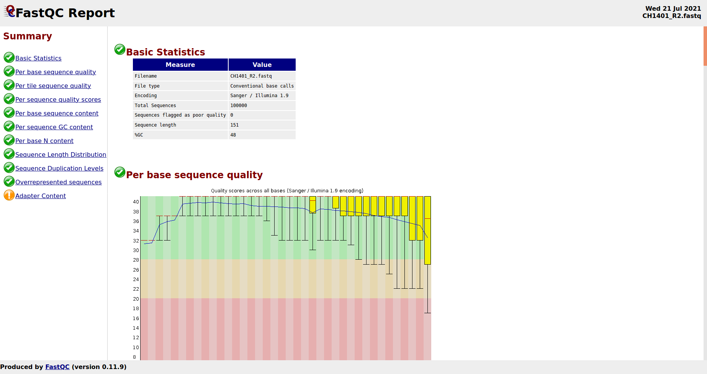

INTRODUCTION TO NGS DATA EXERCISES
==================================

Set some environmental variables (assume bams are in ${DIR}/data/bams and fastq are in ${DIR}/data/fastq)

	DIR=/home/tyler/Desktop/workshop_tmp
	mkdir "$DIR/output"
	TRIMJAR=/home/tyler/install/Trimmomatic-0.39/trimmomatic-0.39.jar

## fastq

Have a look inside one of the frog fastq files

	less "$DIR/data/fastq/CH1401_R1.fastq"

visualize data with fastqc. You can get some help info with `fastqc --help`
Will automatically detect file format type, but can specify with `-f`.

	fastqc -outdir "$DIR/output/" $DIR/data/fastq/*.fastq
	ll "$DIR/output/"

normally you can scp the html files onto your local machine and view them in the web. It would look something like:

Perhaps we have some adapter contamination to worry about so we can check this out without the browser interface

	unzip "$DIR/output/CH1401_R2_fastqc.zip" -d "$DIR/output/"
	
	# check out summary
	cat "$DIR/output/CH1401_R2_fastqc/summary.txt"

	# visualize the extent of adapter contamination (this can take a moment to show up, be patient...)
	eog "$DIR/output/CH1401_R2_fastqc/Images/adapter_content.png"

Can you see what fastq is picking up on? About what percentage of reads show contamination?

## clean fastq

We'll see if we can clean up the adapter contamination and low quality at the ends of the read using cutadapt. Normally run in paired-end mode so that
read pairs are retained. Single-end mode can be run on the forward and reverse reads separately if it's desirable to retain unpaired reads. We'll run on
just the reverse read that we examined for sake of time. Partial sums low-quality trimming using -q 15 (algorithm: https://cutadapt.readthedocs.io/en/stable/algorithms.html#quality-trimming-algorithm)
Specifing Illumina TruSeq adapters (https://support.illumina.com/bulletins/2016/12/what-sequences-do-i-use-for-adapter-trimming.html).

	cutadapt3 -q 15 -a AGATCGGAAGAGCGTCGTGTAGGGAAAGAGTGT --minimum-length 36 -o "$DIR/output/CH1401_R2_clean.fastq.gz" "$DIR/data/fastq/CH1401_R2.fastq"

use fastqc to check what the data quality looks like for CH1401_R2.fasq after trimming

	fastqc -outdir "$DIR/output/" "$DIR/output/CH1401_R2_clean.fastq.gz"

We can see that cutadapt did a good job of cleaning up the data

## Working with mapped data

After you've mapped your cleaned-up fastq reads, you can have a look at the mapping information in SAM/BAM/CRAM files with samtools.

## software
fastqc: https://www.bioinformatics.babraham.ac.uk/projects/fastqc/
cutadapt: https://cutadapt.readthedocs.io/en/stable/index.html
